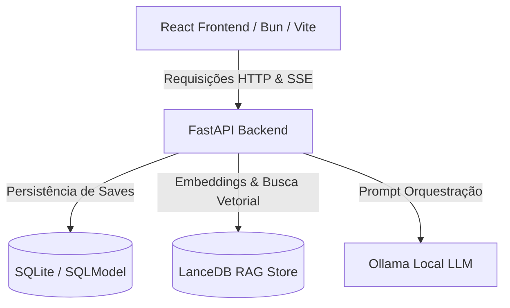

# DnD LLM Game 🎲 (Versão Gold Master - v1.0.0)

O **dnd-llm-game** é um motor digital e interativo de RPG de Mesa (Dungeons & Dragons) guiado por inteligência artificial local (Ollama). O sistema atua como Mestre da Campanha (DM) utilizando um modelo de conversação para narrar aventuras, outro modelo utilitário rápido para resolver as regras, testes de perícia com dados reais em 3D, um gerenciador completo de salvamento de sessões, progressão de personagens (XP/Level Up), e RAG segmentado para Lore Packs temáticos.

---

## 🌟 Principais Recursos (v1.0.0)

1. **Mestre Local com IA**: Narração contextual em tempo real de forma fluida via Ollama.
2. **Streaming SSE (Server-Sent Events)**: As respostas do Mestre são exibidas na tela caractere por caractere (efeito Typing) com latência imperceptível.
3. **Mecânica Referee (Dados 3D)**: Testes de perícia interativos (D20, D6, etc.) integrados ao fluxo do jogo.
4. **Sistema de Save & Load**: Persistência total dos estados da campanha e histórico com SQLModel no SQLite.
5. **Inventário & Progressão**: Adquira itens, gerencie ouro e sofra dano ou cure-se. Mecânica de **Level Up** a cada 100 * Nível XP que aumenta o HP máximo e regenera a vida.
6. **Motor de Lore Temático (RAG)**: Troque o cenário da campanha inteira através de Lore Packs (como *Grimdark Sci-Fi* ou *Brasil Colonial*). A busca vetorial no **LanceDB** segmenta estritamente os dados de cada universo.

---

## 🏗️ Arquitetura e Stack Técnica

O projeto é dividido em uma estrutura moderna de microsserviços desacoplados:



*   **Frontend**: React (SPA), Vite, TypeScript, Bun (gerenciador de pacotes e runtime), Vanilla CSS.
*   **Backend**: Python 3.11+, FastAPI (servidor assíncrono), SQLModel/SQLAlchemy (banco SQLite relacional).
*   **Banco de Dados**: SQLite para dados transacionais e históricos; **LanceDB** como banco vetorial para RAG.
*   **Inteligência Artificial**: **Ollama** executando os modelos locally:
    *   `nomic-embed-text` (geração de vetores RAG).
    *   `llama3.2` ou similar (modelo principal de narração chat).
    *   `granite4:350m` ou similar (modelo utilitário rápido de regras).

---

## 🚀 Como Executar

### Pré-requisitos (Ollama Host)

Antes de iniciar os containers ou rodar localmente, você precisa do Ollama rodando na sua máquina host:
1. Baixe e instale em [ollama.com](https://ollama.com).
2. Baixe os modelos necessários no terminal:
   ```bash
   ollama pull llama3.2
   ollama pull nomic-embed-text
   ```

---

### Método 1: Containerização Completa (Docker Compose - Recomendado)

Toda a infraestrutura do projeto (Frontend Nginx e Backend FastAPI) pode ser iniciada com um único comando. O backend se comunica com o Ollama no host local através do endereço `host.docker.internal`.

1. Suba os containers:
   ```bash
   docker-compose up --build
   ```
2. Acesse a aplicação no navegador em:
   [http://localhost](http://localhost)

*Os saves de jogo e os vetores do LanceDB são persistidos no volume nomeado `backend_data`.*

---

### Método 2: Execução Manual (Desenvolvimento Local)

Se você preferir executar sem Docker, certifique-se de possuir o **Bun** e o **Python 3.11+** instalados.

1. Clone o repositório e acesse a pasta do projeto:
   ```bash
   git clone https://github.com/tegridydev/dnd-llm-game.git
   cd dnd-llm-game
   ```
2. Inicialize o ambiente local com o launcher automático:
   ```bash
   bun run dev
   ```
   *O script irá sincronizar as dependências do Python no ambiente virtual `.venv`, instalar as dependências do React com Bun, e iniciar ambos os servidores (FastAPI na porta 8765 e Vite na porta 5173).*

---

## 🛠️ Guia de Contribuição (Contributing)

Contribuições de código limpo são muito bem-vindas! Siga o roteiro abaixo para colaborar:

### 1. Configurando o Ambiente
Crie uma branch a partir da `main`:
```bash
git checkout -b feature/sua-feature-incrivel
```

### 2. Padrão de Commits
Adotamos a especificação de **Conventional Commits**:
*   `feat:` Nova funcionalidade.
*   `fix:` Correção de bug.
*   `docs:` Alteração na documentação.
*   `style:` Formatação ou CSS sem alteração lógica.
*   `test:` Adição ou correção de testes.

Exemplo: `feat(referee): adiciona suporte a rolagem de dados múltiplos`

### 3. Rodando os Testes Automatizados

Garantir que a cobertura continue verde é obrigatório antes de abrir um PR.

#### Backend (Pytest)
```bash
.venv/bin/pytest backend/tests/
```

#### Frontend (Vitest)
```bash
cd frontend
bun x vitest run
```

### 4. Submetendo Pull Requests
1. Realize o push da sua branch:
   ```bash
   git push origin feature/sua-feature-incrivel
   ```
2. Abra um Pull Request detalhando as alterações visuais e de regras de negócio.
3. Aguarde a aprovação do time de Core Developers e o build do CI passar.

---

## 📄 Licença

Este projeto é disponibilizado sob a Licença MIT. Sinta-se livre para customizar as regras e mestrar suas próprias campanhas!
