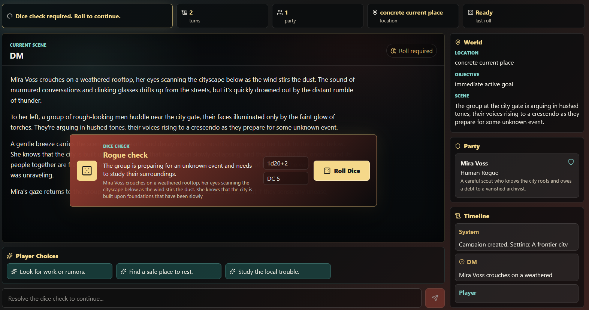

# DND-LLM-GAME

Local-first D&D web app powered by Ollama. The app runs a local Dungeon Master model, a smaller utility model for rules/state/action extraction, streamed responses, dice prompts, reusable heroes, campaign history, and optional PDF lore/RAG.

## Features

- Local DM narration through Ollama
- Separate utility model for dice checks, scene state, and player choices
- FastAPI backend with streamed Server-Sent Events
- Vite React frontend launched by Bun
- SQLite app database through SQLModel
- LanceDB local vector store for uploaded PDF lore
- Hero manager with reusable player characters
- Campaign intro generation from the campaign brief and selected heroes
- Click-to-roll dice checks when the rules referee requires uncertainty



## Requirements

- [Bun](https://bun.sh/)
- Python 3.11+
- [Ollama](https://ollama.com/) running locally

The launcher installs/syncs Python packages with `uv` and frontend packages with Bun. If `uv` is missing, it attempts to install it with Python.

## Quick Start

```bash
git clone https://github.com/tegridydev/dndllm26.git
cd dndllm26
bun run dev
```

The launcher will:

- create/sync `.venv`
- install frontend packages
- start FastAPI on `http://127.0.0.1:8765`
- start Vite on `http://localhost:5173`
- open the browser automatically

## Ollama Models

Start Ollama first:

```bash
ollama serve
```

Pull the default models:

```bash
ollama pull llama3.2:1b
ollama pull granite4:350m
ollama pull nomic-embed-text
```

Copy `.env.example` to `.env` if you want custom models or ports:

```bash
cp .env.example .env
```

Model settings:

```env
OLLAMA_CHAT_MODEL=llama3.2:1b
OLLAMA_UTILITY_MODEL=granite4:350m
OLLAMA_EMBED_MODEL=nomic-embed-text
```

`OLLAMA_CHAT_MODEL` is the main DM narrator. `OLLAMA_UTILITY_MODEL` should be a smaller/faster model used for dice decisions, world-state extraction, and dynamic player choices. If it is blank, the app falls back to the main chat model.

## Using Lore PDFs

Upload PDFs from the Lore panel, or place PDFs in `data/uploads`. The app discovers queued PDFs and indexes them into LanceDB using the configured embedding model. Indexed lore is retrieved into DM prompts and rules/state context.

Runtime data is stored in `data/` and is intentionally ignored by git.

## Scripts

```bash
bun run dev      # sync deps, start backend + frontend, open browser
bun run start    # same as dev
bun run build    # type-check and build the frontend
```

## Project Layout

- `backend/dndllm26/api`: FastAPI routes
- `backend/dndllm26/core`: settings
- `backend/dndllm26/db`: SQLite models and sessions
- `backend/dndllm26/game`: campaign, dice, hero, and world-state orchestration
- `backend/dndllm26/llm`: Ollama client
- `backend/dndllm26/rag`: PDF extraction, chunking, LanceDB search
- `frontend/src`: React app and styles
- `scripts/start-dev.ts`: one-command local launcher

## Notes

DM responses are capped for playability (Feel free to change and experiment!): max 1000 characters and max 200 words. The utility model generates the player-choice buttons after each DM response, so the main DM can focus on narration.
